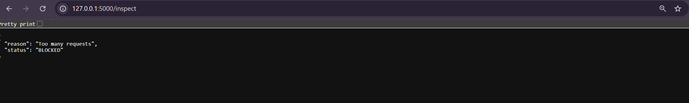

# 🛡️ SentinelShield-WAF

> Lightweight Web Application Firewall (WAF) & Intrusion Detection System (IDS) built with Flask.


---

## 🚀 Live Demo

🔗 Deployed Application

https://sentinelshield-waf-bb8q.onrender.com

---

## 📌 Overview

SentinelShield is a lightweight cybersecurity platform that simulates the core functionality of modern Web Application Firewalls (WAFs) and Intrusion Detection Systems (IDS).

The system inspects incoming HTTP requests, detects malicious payloads using signature-based detection, performs abuse monitoring through rate limiting, generates security logs, and visualizes threats through an interactive SOC dashboard.

---

## ✨ Features

✅ HTTP Request Inspection

✅ SQL Injection Detection

✅ Cross-Site Scripting (XSS) Detection

✅ Command Injection Detection

✅ Directory Traversal Detection

✅ Local File Inclusion (LFI) Detection

✅ Rate Limiting & Brute Force Protection

✅ Security Event Logging

✅ Interactive SOC Dashboard

✅ Attack Analytics Visualization

---

## 🏗️ System Architecture

```text
Incoming Request
       ↓
Request Inspection
       ↓
Detection Engine
       ↓
Allow / Block Decision
       ↓
Security Logging
       ↓
SOC Dashboard
```

---

## 🎯 Attack Detection Coverage

| Attack Type | Supported |
|------------|-----------|
| SQL Injection | ✅ |
| XSS | ✅ |
| Command Injection | ✅ |
| Directory Traversal | ✅ |
| Local File Inclusion | ✅ |
| Rate Limiting Abuse | ✅ |

---

## 📊 Dashboard Preview


---

## 🔥 SQL Injection Detection


---

## 🚫 XSS Detection


---

## ⚡ Rate Limiting Protection



---

## 📜 Security Logs


---

## 🛠️ Tech Stack

- Python
- Flask
- Regex-based Detection Engine
- HTML / CSS
- Chart.js
- JSON Logging

---

## ⚙️ Installation

```bash
git clone https://github.com/pugazh-10/SentinelShield-WAF.git

cd SentinelShield-WAF

pip install -r requirements.txt

python app.py
```

---

## 🌐 Access Dashboard

```text
http://127.0.0.1:5000/dashboard
```

---

## 👨‍💻 Author

Pugazh

Cybersecurity Practical Project
